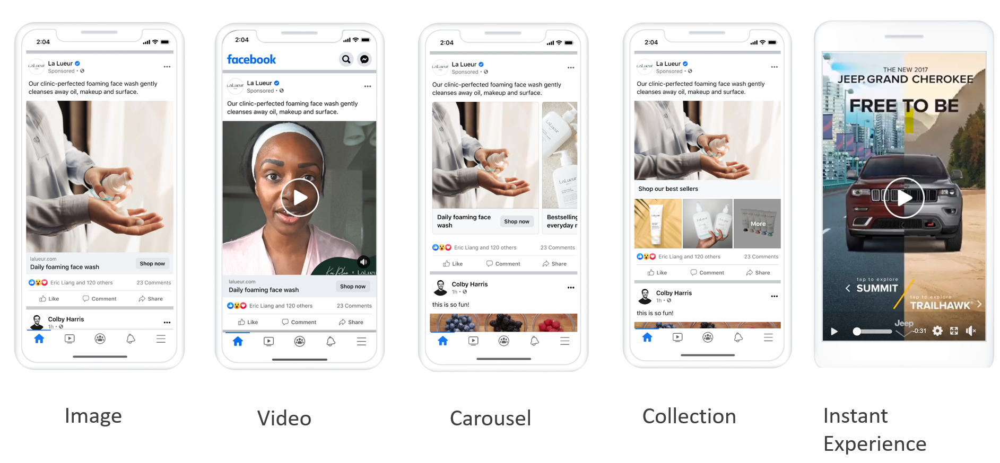
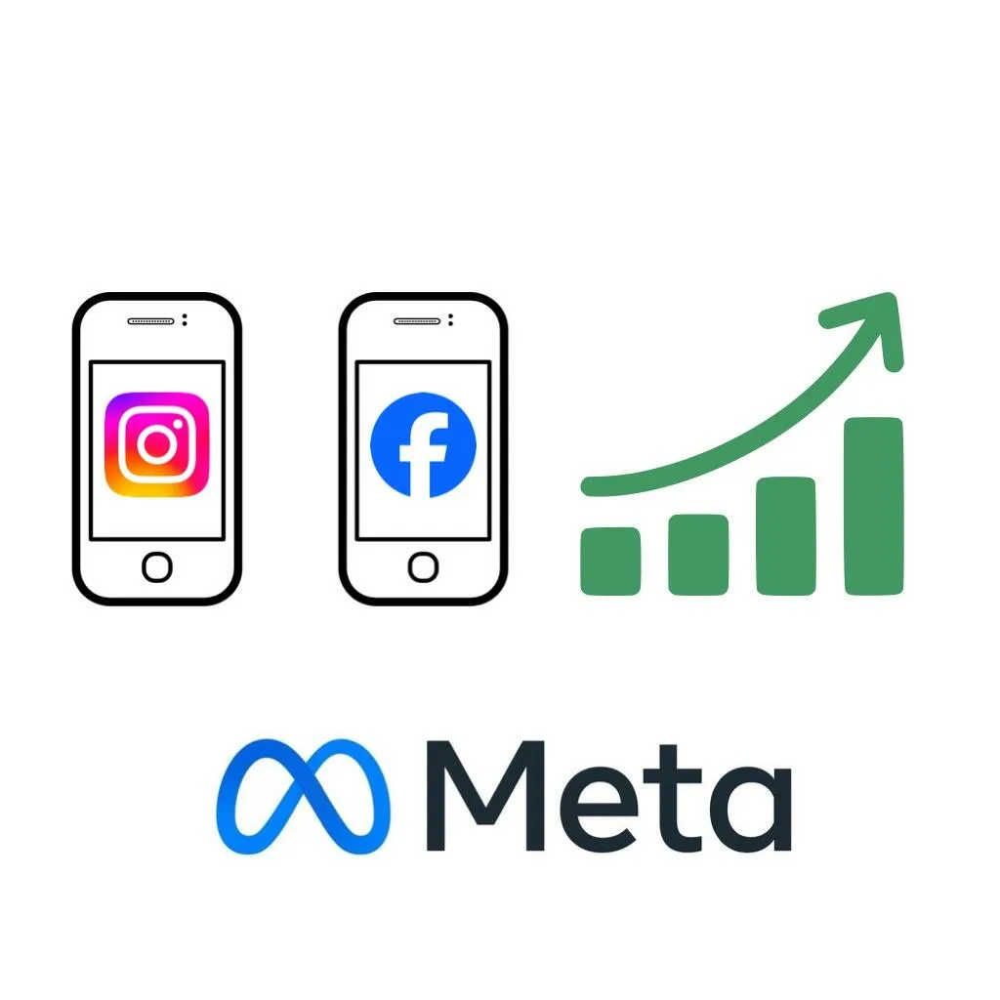
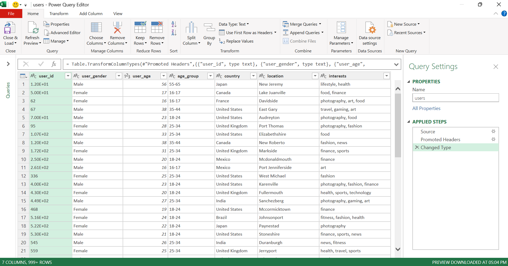
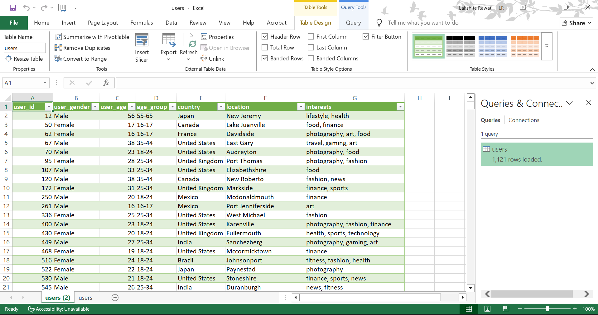
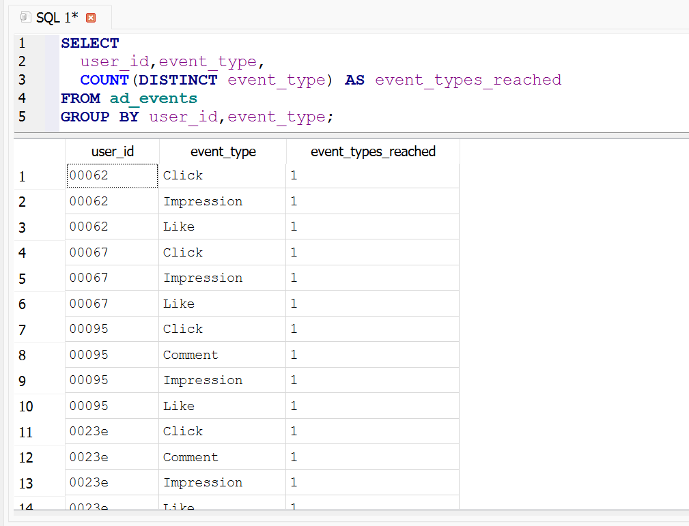
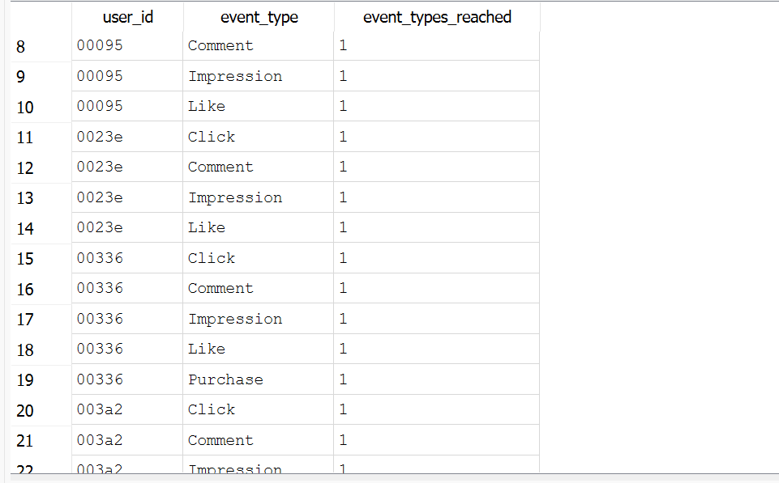

# Meta Ads Performance Analytics

    

**Meta Ads** are digital advertisements placed across **Facebook, Instagram, Messenger,** and the Audience Network, allowing businesses to target users based on demographics, interests, and behavior. Formerly known as Facebook Ads, this system uses data-driven, highly customizable ad formats like videos, images, and carousels to increase brand awareness, website traffic, and sales. 

## Project Overview
- This project focuses on analyzing social media advertising campaign performance using SQL and Power BI. The dataset contains information about ad campaigns, individual advertisements, user demographics, and user interaction events such as views and clicks. 
- The objective of the project is to explore how different advertising strategies perform across platforms like Facebook and Instagram. 
- By combining campaign data, advertisement details, and user interaction events, the project aims to uncover insights related to audience targeting, engagement patterns, and campaign effectiveness. The analysis is performed using SQLite for data cleaning and analytical queries, and Power BI for interactive dashboards and visualization of key marketing insights.

## Data Sources
The [dataset](https://drive.google.com/drive/folders/1kiJFKdE6Lk-k4UlVS50GkrtcMJjnL_w1) used in this project is a simulated digital advertising dataset designed to represent advertising campaigns running on social media platforms such as Facebook and Instagram. The data contains information about ad campaigns, individual ads, user demographics, and user interactions with advertisements.
The dataset is organized into four CSV files that represent different entities within a marketing campaign ecosystem. These files were imported into SQl, Excel,Power BI and used for data cleaning, SQL analysis, and visualization.

#### 1. ad_events.csv
This file contains user interaction data with advertisements. Each record represents an event triggered by a user when interacting with an ad.
* event_id – unique identifier for each event
* ad_id – identifier linking the event to a specific ad
* user_id – identifier of the user who interacted with the ad
* timestamp – time when the event occurred
* day_of_week – day when the interaction happened
* time_of_day – categorized time period (morning, afternoon, evening, night)
* event_type – type of interaction (e.g., view, click, engagement)

#### 2. campaigns.csv
This dataset contains campaign-level information describing the marketing campaigns under which ads are grouped.
* campaign_id – unique identifier for each campaign
* campaign_name – name of the campaign
* start_date – campaign start date
* end_date – campaign end date
* duration – total campaign duration
* total_budget – allocated budget for the campaign

#### 3. ads.csv
This file provides detailed information about individual advertisements.
* ad_id – unique identifier for each ad
* campaign_id – identifier linking the ad to its campaign
* ad_platform – platform where the ad was displayed (Facebook or Instagram)
* ad_type – type of advertisement (image, video, carousel, etc.)
* target_gender – gender targeted by the advertisement
* target_age_group – age group targeted by the ad
* target_interest – audience interest category used for targeting

#### 4. users.csv
This dataset contains demographic and interest information about users who interacted with the ads.
* user_id – unique identifier for each user
* user_gender – gender of the user
* age – age of the user
* age_group – categorized age range
* country – user’s country
* location – city or region of the user
* interest – user’s primary interest category

## Data Cleaning and Processing
Before performing SQL analysis, the raw data was cleaned and prepared using Microsoft Excel Power Query to ensure accuracy, consistency, and usability for further analysis.
### 1. ad_events.csv
#### **Raw Data**

#### Cleaned Data

### 2. ad.csv
#### **Raw Data**

#### Cleaned Data

### 3. campaign.csv
#### **Raw Data**

#### Cleaned Data

### 4. users.csv
#### **Raw Data**

#### Cleaned Data

## Database Schema
After data cleaning, the datasets were imported into a SQLite database for relational analysis. The database consists of four tables representing different components of a digital advertising system.
* **campaigns** – Contains campaign-level information such as campaign name, duration, and budget.
* **ads** – Stores details about individual advertisements, including platform, ad type, and targeting attributes.
* **users** – Contains demographic information about users who interacted with advertisements.
* **ad_events** – Records user interactions with ads such as views, clicks, or engagements along with timestamps.
  
These tables are connected through unique identifiers:
* **campaign_id** links **ads** to **campaigns**
* **ad_id links** **ad_events** to **ads**
* **user_id** links **ad_events** to **users**
This relational structure enables deeper analysis of campaign performance, audience engagement, and targeting effectiveness.

## SQL Analysis
SQL was used to perform detailed marketing analytics on the cleaned dataset.
### **1. Event Funnel & Engagement Depth Analysis**
(How users interact with ads across funnel stages)
### a. Overall Funnel Distribution

 

### b. Unique Users per Funnel Stage

### c. User Drop-Off Analysis (Engagement Depth)

 

 

### d. Conversion Depth per Ad

### Overall Insight
Most users interact with ads at the impression and click stages, but only a small fraction progress to conversion. This indicates significant funnel drop-offs, suggesting that while awareness generation is strong, conversion efficiency can be improved through better targeting, creative optimization, or landing page experience.

### 2. Campaign-Level Performance & Budget Efficiency
### a. Events per Campaign

### b. Users Reached per Campaign

### c. Budget Normalization (Events per Budget Unit)

### Overall Insight
Campaign-level comparison of total events and allocated budget reveals variations in engagement efficiency. Some campaigns generate high interaction volumes despite moderate budgets, while others show limited engagement relative to their spending, indicating potential optimization opportunities.

### 3. Platform Performance (Facebook vs Instagram)
### a. Event Volume by Platform

### b. Conversion Rate by Platform

The analysis focused on several key areas:
* Campaign performance analysis
* Platform-wise ad engagement
* Audience demographic insights
* Ad targeting effectiveness
* User interaction patterns
* Detection of inefficient ads and engagement gaps

These queries helped uncover meaningful insights about how different campaigns and advertisements perform across platforms and audience segments.

